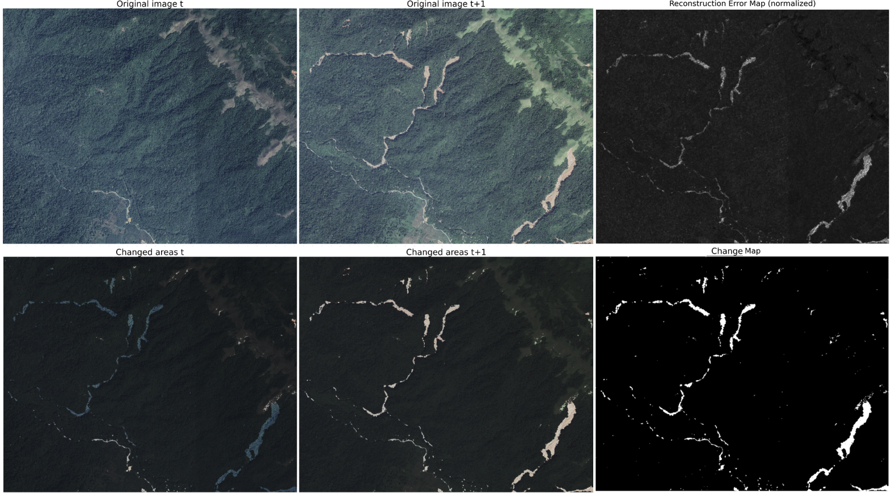

**Signal Processing Laboratory of the Centre Spatial de Liège — Centre Spatial de Liège (University of Liège)**
**Internship period:** 16 June 2025 to 12 September 2025
**Supervisor:** Murielle Kirkove
**Academic year:** 2024–2025

---

## 1. Overview

This internship took place at the Signal Processing Laboratory of the Centre Spatial de Liège (CSL), within the University of Liège. It contributed to the **EDITOR project (Environmental hazards associated with mining activities in the tropics)**, a multidisciplinary initiative aimed at evaluating the environmental and social impacts of mining in the Democratic Republic of Congo (DRC).

The work focused on the **detection of spatio-temporal changes** using **opticzl & SAR (Synthetic Aperture Radar) images** and **unsupervised machine learning**.

I cannot disclose detailed implementation specifics of the change‑detection code. A recommendation letter is included in the repository (see ./Recommendation_letter_from_M-Kirkove.pdf) for further context on tasks and skills demonstrated during the internship.

---

## 2. Objectives

* Design and implement a machine learning model capable of detecting and analyzing significant changes in optical & SAR image time series
* Adapt a **joint convolutional autoencoder** for change detection without labeled data
* Optimize and document the codebase for processing and analysis
* Develop a structured system for configuration, execution, and result management

The main reference paper was *Change Detection in Satellite Images using Reconstruction Errors of Joint Autoencoders* (Kalinicheva et al., 2020).

---

## 3. Context

### 3.1 The Centre Spatial de Liège (CSL)

The CSL is a major European research institution in space science and technology, working with ESA, NASA, and industrial partners. It specializes in:

* **Environmental testing** of space instruments (vacuum, vibration, extreme temperatures)
* **Development of space systems** for missions such as *Herschel, Planck, Gaia,* and *JWST (MIRI instrument)*
* **Technological innovation** in optics, electronics, mechanics, and signal processing

### 3.2 The Signal Processing Laboratory

Founded in 1989, the laboratory is recognized for its expertise in **radar image analysis**, particularly **SAR data processing**. Its work includes algorithm development for deformation monitoring, land-use changes, and object detection.

### 3.3 The EDITOR Project

The project investigates environmental hazards caused by mining in tropical regions, particularly in cobalt- and tin-rich areas of the DRC.
It is divided into four work packages:

1. **Detection of environmental changes** (CSL’s responsibility)
2. **Mineralogical characterization**
3. **Regional trend analysis using machine learning**
4. **Study of population vulnerability**

The CSL’s contribution focuses on **developing change detection algorithms** using SAR imagery and unsupervised deep learning.

---

## 4. Result example on optical images
            

           