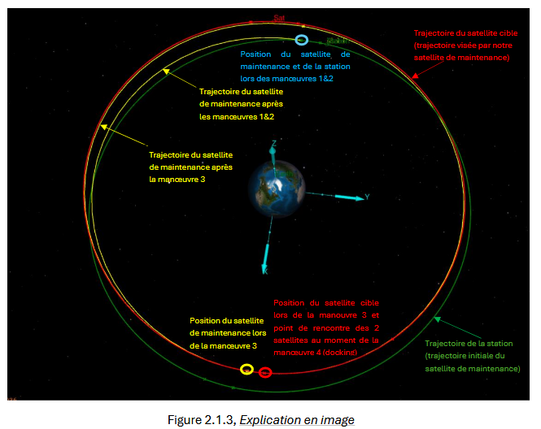
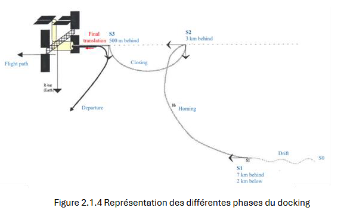
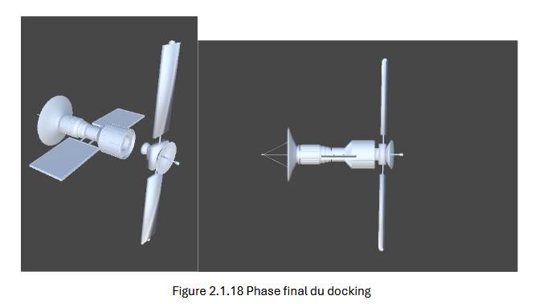
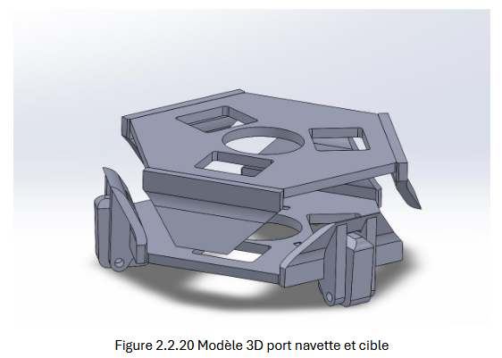

# In-Orbit Maintenance Project - ALTEN / ESTACA (2023-2024)

## Project Team

**Team Members:** Paul Collette, Alexandre Boehler, Vincent Garreau, Alexandre François, Tadessé Nicoly, and Quentin Tricaud

**Institution:** ESTACA (3rd-year Industrial Project - Space Major)

**Industry Partner:** ALTEN

**Supervisors:** Margot Raynal and Benoît Bieri

---

## Project Overview

This six-member group project, developed in partnership with ALTEN, explores the concept of in-orbit satellite maintenance within the framework of the New Space industry. The objective was to design and simulate a complete in-orbit servicing mission, including:

- Trajectory planning and orbital rendezvous (docking) between a servicing spacecraft and a client satellite
- The design and dimensioning of a universal docking port for fuel, data, and power transfer

The project was carried out over eight months and aimed to assess the technical and economic feasibility of a commercial maintenance solution for satellites operating in geostationary orbit (GEO).

---

## Context - The Rise of In-Orbit Servicing in the New Space Era

Traditional space missions rely on one-shot satellites with limited lifespans. As launch costs and orbital congestion rise, extending satellite service life has become a major economic and ecological goal.

The New Space movement—driven by private companies such as SpaceX, OrbitFab, and Northrop Grumman—focuses on:

- Reusable and maintainable systems
- Reduced costs and development time
- Open, iterative innovation cycles

In this context, in-orbit maintenance (OOS: On-Orbit Servicing) offers several potential services:

- **Refueling:** Extending lifetime by replenishing propellant
- **Repair:** Replacing or fixing failed components in orbit
- **Towing:** Using a "space tug" to reposition or deorbit satellites

The project's ambition was to simulate and design a feasible OOS architecture inspired by emerging commercial concepts like OrbitFab's orbital refueling network.

---

## Project Management and Structure

The project was conducted in two main phases:

### Research Phase (Oct-Dec 2023)

- Individual literature reviews on in-orbit maintenance technologies
- Brainstorming sessions and system breakdown using SADT diagrams
- Evaluation of several mission architectures (single-use, modular, station-based)

### Development Phase (Jan-May 2024)

- Focus narrowed to the critical docking phase
- The team was divided into two subgroups:
  - **Trajectory & Simulation Group:** orbital analysis, mission planning, GMAT simulations, and Unity visualization
  - **Mechanical Design Group:** conception and sizing of the universal docking port
- Frequent team meetings, supervision by ALTEN mentors, and shared documentation through collaborative drives ensured coordination and traceability

## Mission Architecture Analysis

The team studied three possible architectures:

### 1. Single-Use Servicer
One satellite maintains one client. Simple but expensive.

### 2. Modular Design
Reconfigurable satellites composed of interchangeable modules (inspired by DARPA's Phoenix program).

### 3. Station-Delivery System (Final Choice)

Inspired by OrbitFab's "RAFtI" refueling ports, this concept uses:

- Orbital fuel depots (stations) placed in GEO
- Shuttle vehicles performing round trips to deliver fuel or perform repairs

This station-based approach minimizes launch costs and enables multiple maintenance missions from a single infrastructure.

## Docking Simulation - Trajectory and Orbital Mechanics

The docking phase was identified as the most critical and complex part of in-orbit maintenance. The goal was to design a rendezvous trajectory between a servicing satellite and a client satellite in geostationary orbit, using:

- GMAT (General Mission Analysis Tool) for orbital simulations
- Python for numerical validation
- Unity for 3D visualization

### Orbital Strategy

- **Target Orbit:** Geostationary (0 degrees inclination, circular orbit at 42,164 km)
- **Station Location:** Placed in GEO to minimize delta-V and allow multiple clients
- **Example Client:** Galaxy-11 satellite (real GEO satellite)

### Simulation Setup

- Delta-V optimization using GMAT's Target and ImpulsiveBurn modules
- Environmental modeling: Earth gravity harmonics (J2-J10), solar/lunar gravity, radiation pressure
- Full mission sequence simulated (departure, approach, docking, return)

### Results

- **Total Delta-V:** approximately 1.5 km/s for the nominal mission
- **Propellant Consumption:** approximately 218 kg (approximately 15% of the refueled mass)
- **Viability:** Even with more complex orbits (inclined or eccentric), missions remain viable (less than 500 kg propellant)
- **Animation:** A complete video animation of the mission was developed using GMAT output and Unity rendering

---

## Mathematical Modeling - Docking Phases

Two main proximity phases were studied and simulated:

### Homing Phase (S1 to S2)

- Satellite aligns and reduces distance using simplified Gauss equations
- Validation through Python simulation with numerical correction (delta-Vt approximately 2.77e-3 km/s)

### Closing Phase (S2 to S3)

- Controlled approach within a few hundred meters using radial orbit offset technique
- Required delta-Vn approximately 6.3e-5 km/s
- Equations of motion reconstructed as second-degree polynomial functions for Unity integration

These results formed the basis for the Unity docking simulation.

---

## Unity Simulation - Virtual Docking Demonstrator

To visualize and validate the docking process, the team developed a 3D interactive simulation in Unity, programmed in C#.

### Key Implementation Steps

- **Environment Setup:** Creation of satellite models and waypoints (S1, S2, S3)
- **Trajectory Implementation:** Integration of mathematical models derived from Python
- **Physics Engine:** Simplified gravitational interactions using Unity's Rigidbody system
- **Docking Logic:** Automatic alignment, proximity detection, and controlled approach using real-time scripting

The result is a dynamic visual model of a servicing satellite performing a complete approach and docking maneuver, from orbital alignment to final attachment.

---

## Mechanical Design - Universal Docking Port

Parallel to the orbital study, the second subgroup designed a Universal Docking Interface (UDI) capable of:

- Mechanical connection
- Fluid transfer (refueling)
- Electrical and data transmission

### Methodology

#### Benchmark of Existing Solutions

- Apollo Docking System (manned missions)
- OECS from Orbital Express (2007)
- RAFTI interface by OrbitFab (fluid transfer standard)

#### 3D CAD Modeling (SolidWorks)

- Creation of a compact, unmanned docking mechanism
- Integration of multiple subsystems:
  - **Fluid Port:** Flow management and sealing system
  - **Electrical Connector:** Power transfer interface
  - **Data Port:** Digital communication link
- Thermal and mechanical reinforcements

#### Dimensioning and Integration

- Structural sizing to resist launch loads and in-orbit stresses
- Thermal considerations for varying space conditions
- Final assembly modeled and validated through SolidWorks 3D integration

The result is a multifunctional docking port designed to serve as a standardized interface between orbital assets—compatible with future servicing missions.

---

## Main Achievements

- Definition of a commercially viable in-orbit maintenance architecture
- Realistic trajectory simulation and energy budget analysis for GEO missions
- Creation of a Unity-based virtual docking demonstrator
- Design and dimensioning of a universal multi-purpose docking port
- Compliance with aerospace engineering methodologies (iteration, verification, documentation)

---

## Teamwork and Professional Experience

Throughout this eight-month group project, the six team members learned to work as a cohesive engineering unit, handling:

- Project management (Gantt tracking, deliverables, documentation)
- Technical communication with industrial mentors at ALTEN
- Division of roles between simulation, design, and integration
- Application of theoretical knowledge in mechanics, orbital dynamics, and system design

This collaborative project strengthened the team's ability to design, simulate, and justify a complete space mission—bridging the gap between academic theory and real aerospace engineering challenges.