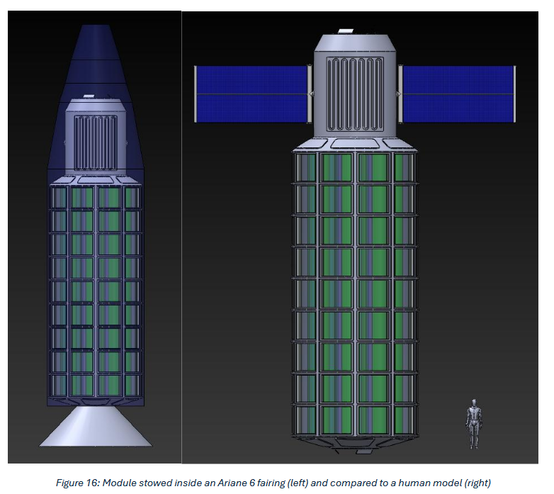
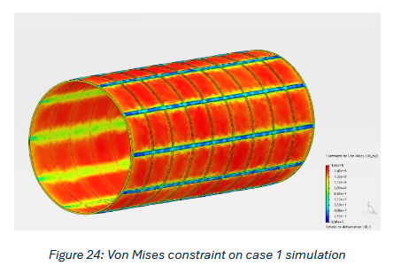
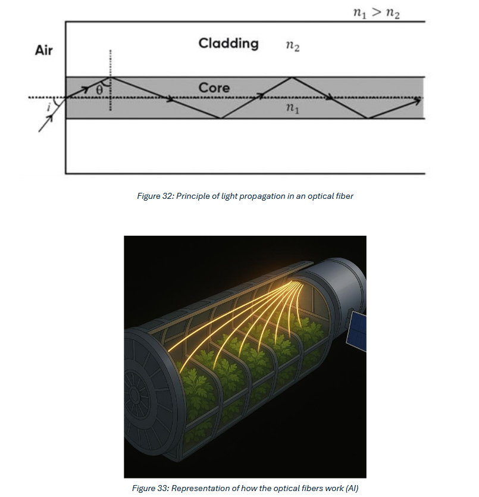

# SPACE OASIS - Quick Project Overview (2024-2025)

**Team:** Elisa Lemoine, Paul Collette, Alexandre Boehler, Vincent Garreau, Alexandre François

**Institution:** ESTACA - in collaboration with The Spring Institute for Forest on the Moon

**Project type:** Group Engineering Research Project (P2I - Integrated Engineering Project)

**Supervisors:** Louise Fleischer

---

## Table of contents

- [SPACE OASIS - Quick Project Overview (2024-2025)](#space-oasis---quick-project-overview-2024-2025)
  - [Table of contents](#table-of-contents)
  - [Project objective](#project-objective)
  - [Background \& context](#background--context)
  - [Methodology](#methodology)
  - [Thermal sensitivity analysis](#thermal-sensitivity-analysis)
  - [Module design and CAD](#module-design-and-cad)
  - [Thermal/ Mechanical -structural simulations](#thermal-mechanical--structural-simulations)
  - [Sunlight management (optical study)](#sunlight-management-optical-study)
  - [Development \& verification plan (ECSS framework)](#development--verification-plan-ecss-framework)
  - [Scientific \& engineering impact](#scientific--engineering-impact)
  - [Team experience \& learning](#team-experience--learning)
  - [Keywords](#keywords)

---

## Project objective

The SPACE OASIS project is a collaborative engineering study conducted by a six-person ESTACA team during the 2024-2025 academic year. In partnership with The Spring Institute for Forest on the Moon, the goal was to design a self-sustaining ecological module for space stations - a bioregenerative life-support system capable of producing oxygen, recycling water, and growing food in microgravity.

This work scales up the PLANT-B CubeSat concept into a full-scale orbital greenhouse module aimed at enabling long-term human presence in space and on the Moon.

## Background & context

Current space missions (e.g., ISS) depend on regular resupply from Earth. That model is not sustainable for deep-space or lunar missions. SPACE OASIS explores closed-loop ecosystem concepts inspired by terrestrial cycles to reduce Earth dependency and support long-duration missions.

The project contributes to The Spring Institute's vision of creating sustainable ecosystems beyond Earth: "Creating sustainable forests on the Moon - establishing self-sufficient ecosystems for future human life beyond Earth."

## Methodology

The team followed a structured engineering approach compatible with ECSS (European Cooperation for Space Standardization) standards. Main activities included:

- State-of-the-art literature review (space habitats, hydroponics, prior ESTACA projects such as PLANT-B)
- Thermal and mechanical modelling under orbital conditions
- 3D CAD design (SolidWorks / 3DEXPERIENCE)
- FEM simulations (structural and thermal)
- Development & verification planning (NDM → DM → STM → QM → FM)
- Scale prototyping (1:100) for communication and validation
- Optical studies for sunlight delivery (fibers, reflective systems)

Work was distributed across the team to ensure cross-disciplinary collaboration (thermal, mechanical, optical specialties).

## Thermal sensitivity analysis

Objective: keep internal temperatures between ~10 °C and 40 °C (plant viability). The study evaluated impacts of material choice, internal water mass fraction and orbital altitude.

Key findings:

- The polished-aluminum + dark-glass combination gave the best compromise between thermal stability, mass and cost.
- Gold coatings improved thermal performance but were cost-prohibitive.
- Higher internal water fraction increased thermal inertia and reduced temperature swings.
- Lower orbital altitudes increased shadow frequency from Earth, reducing solar heating.

Recommended (optimal) configuration from the study: polished aluminum structure, dark glass windows, ~15% internal water mass.

## Module design and CAD

- Geometry: cylindrical module, approx. 6.3 m diameter × 10 m length
- Launch compatibility considered for: Ariane 6, Vulcan Centaur, New Glenn
- Internal layout: 8–16 hydroponic cylinders (≈1 m diameter × 10 m length each)
- Estimated dry mass: ~6–10 t, depending on reinforcement
- Tools: SolidWorks and 3DEXPERIENCE (for design and simulation link)

The design emphasizes modularity and scalability while remaining compatible with current European launcher fairings.

## Thermal/ Mechanical -structural simulations

Simulations (Ansys, Dassault 3DEXPERIENCE) considered combined pressure, thermal and static loads.

- Material selected for analysis: Aluminum 6061 (common in ISS structures)
- Safety objective: factor of safety > 2

Parameters studied: wall thickness (10-100 mm), temperature ranges (273-643 K), number/geometry of reinforcement rings.

Findings:

- Reinforcements improved strength without excessive mass penalty.
- The baseline structure remained stable under 1 atm internal pressure and the applied thermal loads.

Suggested future work: dynamic thermal cycling studies and fully coupled multiphysics simulations.

## Sunlight management (optical study)

Challenge: deliver sufficient natural light for photosynthesis while keeping structural integrity.

Study results:

- Multi-mode optical fibers (50 μm–1 mm cores) can transfer light short distances but would require extremely large quantities to meet plant PPFD needs (~600 μmol·m⁻²·s⁻¹ for tomato-like crops).
- Pure fiber-based lighting was judged impractical at scale.
- Proposed alternative: reflective light-distribution tubes (~25 cm diameter) to concentrate and distribute sunlight more efficiently inside hydroponic zones.

## Development & verification plan (ECSS framework)

The team produced a Development and Verification plan compliant with ECSS, covering:

- Subsystem breakdown: enclosure, propulsion, docking, hydroponic units
- Model hierarchy: NDM → DM → STM → QM → FM
- Environmental tests: vibration, vacuum, acoustic, radiation, thermal cycling
- Launch constraints and interface (Ariane 6 fairing Ø ~5.4 m, total mass targets)
- AIT (Assembly, Integration & Test) and docking safety procedures

This plan forms a roadmap toward a flight-ready demonstrator.

## Scientific & engineering impact

SPACE OASIS prototypes concepts for orbital greenhouses that combine passive thermal control, hydroponics and closed-loop biological processes to support long-duration human missions.

The project demonstrates viable design trade-offs and identifies engineering routes to reduce resupply dependency.

## Team experience & learning

The project provided intense multidisciplinary experience in:

- Systems engineering under ECSS constraints
- Cross-domain collaboration (thermal, structural, optical)
- Iterative problem-solving with modelling and prototyping

The team gained practical skills in aerospace workflows and a deeper appreciation for sustainability in extreme environments.

## Keywords

Bioregenerative Life Support · Space Greenhouse · Thermal & Structural Analysis · Orbital Habitat · Space Agriculture · Closed Ecological System · ECSS Standards

