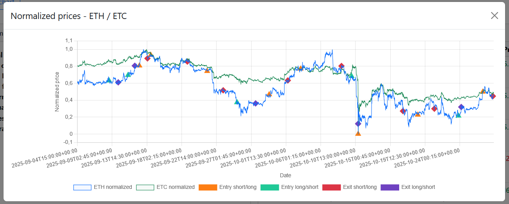

**This application represents the first iteration of a project I’m developing independently with a friend. I will not show more of the application because I wish to keep it for myself for now, the ambition is to integrate advanced techniques, maximizing automation through trading bots, and test innovative methods especially those powered by machine learning.**

# 🚀 Pair Trading Application
*to run the app -> create the environment (environment.yml) -> in a terminal go to: cd ~/TradingApp -> type: python run.py -> In the terminal you see: Running on http://XXXXXXXX, ctrl+click on it or go in your navigator and type in the url bar: http://XXXXXXXX*


## 📋 Objective

This Flask application is a **comprehensive pair trading platform for cryptocurrencies**. It enables traders to:

- **Identify cointegrated pairs** between cryptocurrencies by analyzing their correlation and cointegration
- **Calculate z-scores** of the spread to detect trading opportunities
- **Manage long/short positions** with leverage and automatic P&L calculation
- **Backtest trading strategies** on historical data
- **Visualize results** with interactive graphs

## 🎯 Concept - Mean Reversion Pair Trading 

### What is Pair Trading?

Pair trading is a statistical trading strategy that exploits the relationship between two assets (cryptocurrencies in this case):

1. **Identify two correlated cryptos** that move together 
2. **Verify their cointegration**: their spread oscillates around a mean (stationarity)
3. **Calculate the z-score of the spread**: measure of deviation from the mean
4. **Open a position** when z-score > + ``x`` * σ or z-score < - ``x`` * σ
5. **Close when** the spread reverts to a given value.

### Advantages

✅ **Market-neutral**: no need to predict the general market direction  
✅ **Risk reduction**: long one crypto, short the other (hedge)  
✅ **Mean reversion**: exploit a reliable statistical relationship  
✅ **Automatable**: clear and objective signals  

## 🔧 Main Features

### 1. **Pair Analysis**
- Pearson correlation coefficient calculation
- Cointegration test (Engle-Granger with ADF)
- Support for multiple timeframes: 15m, 1h, 4h, 1d, 3d, 1w

### 2. **Z-Score Calculation**
- Spread: `Spread = Crypto_A - β × Crypto_B`
- Z-score: `(Spread - μ) / σ` with rolling window

### 3. **Complete Backtesting**
- Configurable period
- position sizing adjusted to volatility
- Pair rescanning every N days
- Full simulation with fees
- Detailed report generation


### 4. **Visualizations**
- Trade history
- P&L distributions


                   


## ⚙️ Configuration

Key parameters are configurable in `BacktestConfig`:

```python
# Timeframes
timeframe = "15m"              # 15m, 1h, 4h, 1d, 3d, 1w
timeframe_CCC = "1h"           # For correlation/cointegration analysis

# Windows
window = 100                   # Points for z-score (100 × 15m = 1500 min)

# Thresholds
threshold_corr = 0.85          # Minimum correlation
threshold_coint = 0.05         # Maximum p-value for cointegration
threshold_trade = 3.0          # σ for opening (3σ)
threshold_close_position = 0.0 # σ for closing (return to 0)

# Position sizing
leverage = 1.0                 # No leverage by default
position_size_pct = 1.0        # 100% of capital per trade
trading_fee = 0.001            # 0.1% fees

# Rescan
period_before_new_scan = "4w"  # Rescan every 4 weeks
```

## 📈 Usage Examples

### Simple Pair Analysis

```python
from datetime import datetime, timedelta

# Parameters
crypto_a, crypto_b = 'ETH', 'BNB'
period = [datetime(2024, 1, 1), datetime(2024, 12, 31)]
timeframe = '1h'

# Analysis
result = compute_cointegration_correlation(
    crypto_a, crypto_b, period, timeframe=timeframe
)

print(f"Correlation: {result['correlation']:.4f}")
print(f"Cointegrated: {result['cointegrated']}")
print(f"Hedge Ratio (β): {result['hedge_ratio']:.4f}")
print(f"P-value: {result['p_value']:.6f}")
```

### Z-Score Calculation

```python
# Calculate z-score
z_result = compute_z_score(
    crypto_a='ETH',
    crypto_b='BNB',
    current_time=datetime.now(),
    timeframe='15m',
    window=100,
    hedge_ratio=1.234
)

print(f"Current Z-Score: {z_result['current_z_score']:.2f}")
print(f"Signal: {'SHORT ETH / LONG BNB' if z_result['current_z_score'] > 2 else 'HOLD'}")
```

## 📁 Data Structure

### Input Data
```
price_data/
├── BTC_15m.csv       # OHLCV 15-minute data
├── ETH_15m.csv
├── BNB_15m.csv
└── ...
```

## 📚 Resources and References

- **Pair Trading**: [Wikipedia - Pairs Trading](https://en.wikipedia.org/wiki/Pairs_trading)
- **Cointegration**: [StatQuest with Josh Starmer](https://www.youtube.com/watch?v=JdtX4hZNgJ0)
- **Z-Score**: [Investopedia - Z-Score](https://www.investopedia.com/terms/z/zscore.asp)
- **Mean Reversion**: [Mean Reversion Trading Strategy](https://www.investopedia.com/terms/m/meanreversion.asp)
- **Engle-Granger Test**: [Statsmodels Documentation](https://www.statsmodels.org/stable/generated/statsmodels.tsa.stattools.coint.html)

## 📄 Version

**Last Updated**: October 2025  
**Version**: 1.0  
**Author**: paulco-coder
