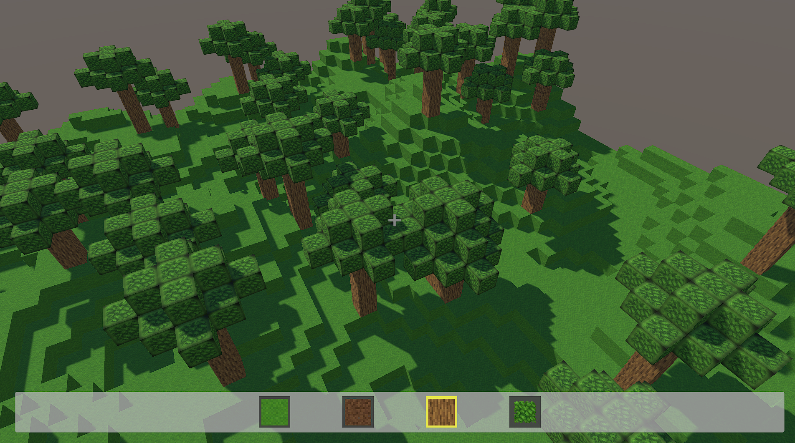

# Unity Voxel Sandbox

A minimalist Minecraft-like prototype. This document explains the project layout, key systems.

## Controls

- `W / A / S / D` or `Z / Q / S / D` (AZERTY) to move.
- `Mouse` to look around.
- `Space` to jump.
- `Left Shift` to sprint.
- Double tap `W` (or `Z`/`Up Arrow`) for a temporary 2x speed boost.
- `Left Mouse` to break blocks.
- `Right Mouse` to place blocks.
- `1-4` to select block types; scroll wheel cycles the hotbar.
- `Esc` unlocks the cursor while testing.

## Core Systems

### Generation (`Assets/Scripts/TerrainGenerator.cs`)
- Uses Perlin noise to determine column heights inside a configurable chunk footprint.
- Creates and parents cubes directly under the generator object for easy cleanup and batching.
- Selects materials per layer: grass on top, dirt beneath, wood as a fallback base.
- Tree spawning is pseudo-random: the script guards chunk edges, stacks wood trunks, then adds a tapered leaf canopy. Adjust tree chance, heights, or noise parameters in the Inspector for quick iteration.

### Block Interaction (`Assets/Scripts/BlockInteractor.cs`)
- Raycasts from the player camera, filtering hits to avoid destroying the player capsule or unrelated colliders.
- Breaks blocks by destroying the hit cube; places blocks by offsetting along the surface normal.
- Maintains a hotbar order, notifies listeners when the selection changes, and exposes textures for UI icons.
- Detects mouse-wheel scroll to cycle the selected block while retaining numeric hotkeys.

### Hotbar UI (`Assets/Scripts/HotbarUI.cs`)
- Binds to `BlockInteractor.SelectionChanged` to keep slot highlights synced with gameplay state.
- Automatically assigns textures to UI `RawImage` icons, so scene-only configuration is required—no code edits when adding textures.
- Uses simple color swapping for the selected frame; replace with custom sprites or animations as desired.

### Player Movement (`Assets/Scripts/PlayerController.cs`)
- Combines `CharacterController` physics with head-bob-free camera pitch control.
- Handles gravity, jumping, sprinting, and a double-tap forward burst that coexists with shift sprinting.
- The double-tap window and multipliers are serialized, making tuning possible directly in the Inspector.
